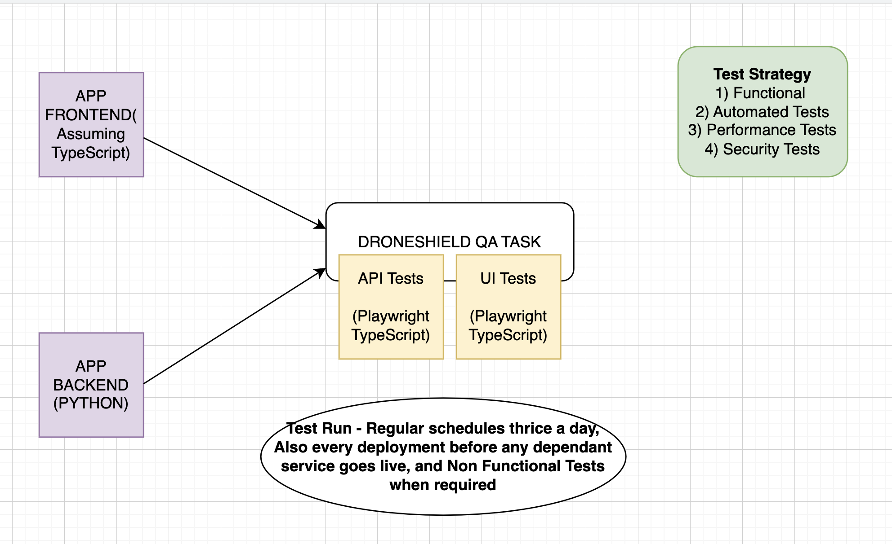

Droneshield - QA Test Task - Jithin Jose Jacob

# Framework

Programming Language - TypeScript

Web Automation - Playwright

API Automation - Playwright

Test Runner - Playwright Test

Reporting - Playwright HTML Report

CI/CD, Docker - Dockerized UI Test which can be run in any CI/CD Tool.

# Prerequisities

1) Nodejs stable version should be installed on your local

2) git should be installed locally

3) Clone the repo to your local machine

4) Run ```npx playwright install`` to install browsers

# UI Tests

1) Follow the .env.example to create a .env file in the root directory

2) Obtain the credentials from ```https://www.saucedemo.com/```

3) Run tests using ```npm run ui-test```

# API Tests

1) Run tests using ```npm run api-test```

# Reports

View reports using ``` npx playwright show-report```

